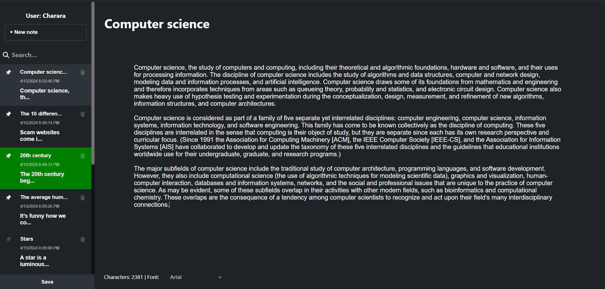

# Simple Note

## Available Scripts

In the project directory, you can run:

### `npm start`

Runs the app in the development mode.\
Open [http://localhost:3000](http://localhost:3000) to view it in your browser.

The page will reload when you make changes.\
You may also see any lint errors in the console.

The json server runs automatically with `npm start` on [http://localhost:4000/notes](http://localhost:4000). Do not run any additional commands for the json server.

## Simple Note Features

### Auto-save

Auto-saves note as you go.

### Pin/Unpin

Pin notes at the top of your list.

### Checked/Done notes

Mark a note as 'Done' by double-clicking it. It will appear in green

### Titles

Change the title of a note by double clicking the large title above the text editor.

### Delete notes

You can delete notes by clicking the icon next to each note. You will be prompted to confirm.

### Search

Filter the notes based on a search query.

### Show More

By default only the first 10 notes are displayed. You can show more notes by clicking the show more button below
the notes displayed.

### Change Fonts

You can change fonts for your notes by clicking on the dropdown menu below the text editor. Please note that the font affects ALL notes.

